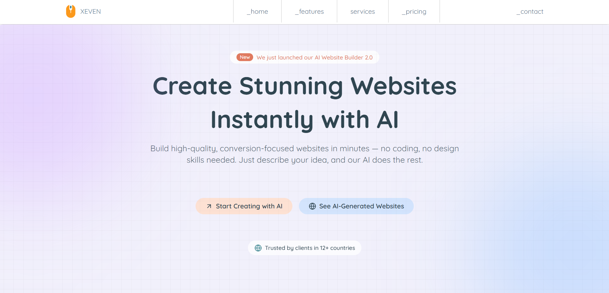
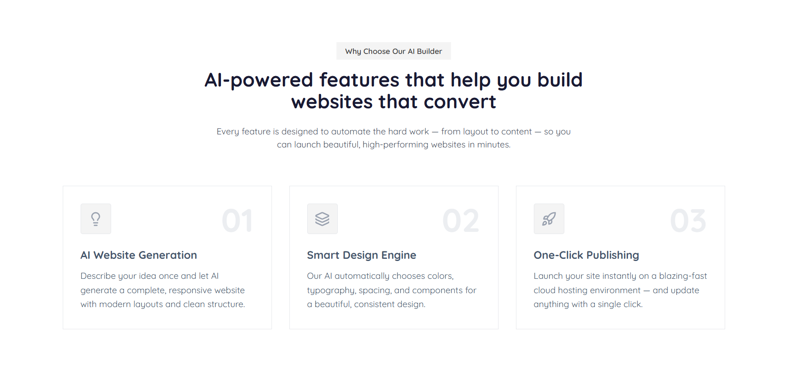
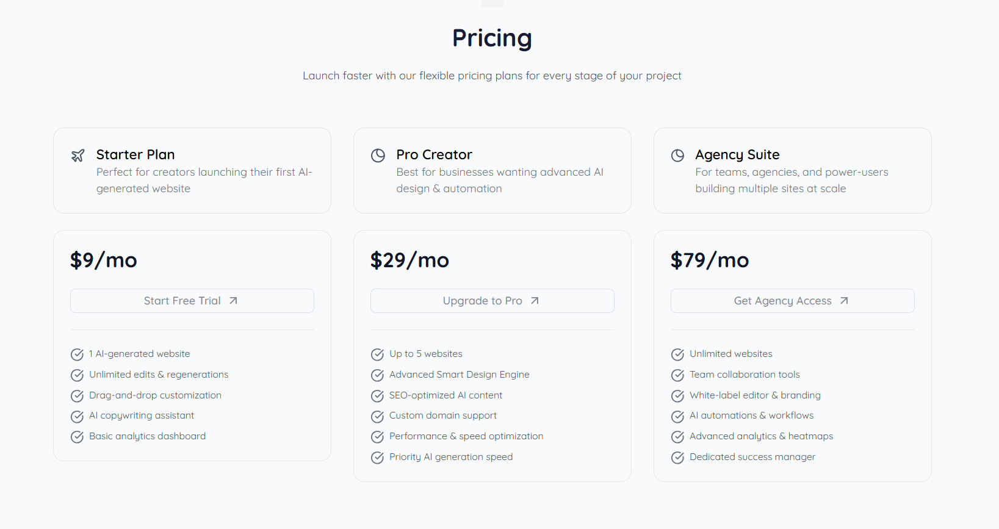

# Flexy UI AI SaaS Landing Page Template

**A modern, minimal, delightful, and fully customizable open-source AI SaaS landing page template built with [Flexy UI](https://www.flexyui.com).**

## Tech Stack

1. Nextjs - v16
2. Tailwind CSS - v4

     

## Overview

Most landing pages follow a very similar structure, usually a combination of **11 essential UI components**.

1. Navbar
2. Hero
3. Stats
4. Section Heading
5. Features Section
6. Services (Bento Grid)
7. Testimonials
8. Pricing
9. CTA Banner
10. FAqs Section
11. Footer

This template includes all of them, powered by **[Flexy UI](https://www.flexyui.com)**, which provides multiple variants for each section so you can:

- Swap layouts
- Change themes
- Customize colors
- Reorder or repurpose sections

Perfect for SaaS products, AI tools, indie hacker projects, and startup landing pages.

## ⭐ Support

If you find this template helpful, show some love by tapping star ⭐ on GitHub — it helps the project grow.

## 📄 License

This project is licensed under the **MIT License**.
